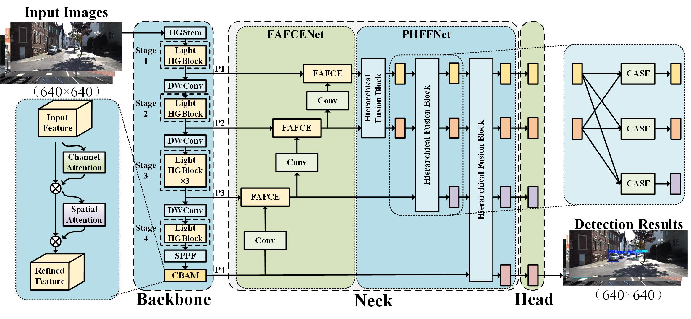

# <div align="center">✨Butter✨</div>


> 🏆 This paper **"Butter: Frequency Consistency and Hierarchical Fusion for Autonomous Driving Object Detection"** has been **accepted to ACM Multimedia 2025**.
> Paper: https://www.arxiv.org/pdf/2507.13373


Butter is a novel 2D object detection framework designed to enhance hierarchical feature representations for improved detection robustness. 

  


<details open>
<summary>Install</summary>
Install ultralytics. Note: Python >= 3.8, PyTorch >= 1.8。

```bash
pip install ultralytics
```

</details>

<details open>
<summary>Usage</summary>

### Single-GPU training
`KITTI` Dataset

```bash
python Butter-KITTI-train.py --model_path ultralytics/cfg/models/Butter/Butter[SCALE]-All-KITTI.yaml --device 0 --name [NAME]
```


The `--model_path` option specifies the specific model configuration, with predefined configurations stored in the `ultralytics/cfg/models/Butter/` directory. `[SCALE]` You may choose between `n`,`s`,`m`,`l`,`x`; if `[SCALE]` is not specified, it defaults to `n`. In the original paper, Butter is a model scaled with `m`. The `--device` option specifies the GPU ID for single-GPU training. The `--name` option sets the name of the training experiment as `[NAME]`, and the final results will be saved under `runs/detect/[NAME]`.  
After training is completed, the best model weights will be saved at `runs/detect/[NAME]/weights/best.pt`.

### Multi-GPU Training  
`Cityscapes` Dataset

```bash
TORCH_DISTRIBUTED_DEBUG=DETAIL python -m torch.distributed.run --nproc_per_node=4 Butter-City-train.py --model_path ultralytics/cfg/models/Butter/Butterm-All-City.yaml --device 1,2,3,6 --name [NAME]
```

The `--nproc_per_node` option specifies the number of GPUs to use. The `--model_path` option specifies the specific model configuration, with predefined configurations stored in the `ultralytics/cfg/models/Butter/` directory. The `--device` option specifies the GPU IDs for multi-GPU training, separated by commas. The `--name` option sets the name of the training experiment as `[NAME]`, and the final results will be saved under `runs/detect/[NAME]`.

`BDD100K` Dataset

```bash
TORCH_DISTRIBUTED_DEBUG=DETAIL python -m torch.distributed.run --nproc_per_node=4 Butter-BDD100K-train.py --model_path ultralytics/cfg/models/Butter/Butterm-All-BDD100K.yaml --device 4,5,6,7 --name [NAME]
```


The `--nproc_per_node` option specifies the number of GPUs to use. The `--model_path` option specifies the specific model configuration, with predefined configurations stored in the `ultralytics/cfg/models/Butter/` directory. The `--device` option specifies the GPU IDs for multi-GPU training, separated by commas. The `--name` option sets the name of the training experiment as `[NAME]`, and the final results will be saved in `runs/detect/[NAME]`.

`COCO` Dataset

```bash
TORCH_DISTRIBUTED_DEBUG=DETAIL python -m torch.distributed.run --nproc_per_node=4 Butter-coco-train.py --model_path ultralytics/cfg/models/Butter/Butter-All-COCO.yaml --device 1,2,3,6 --name [NAME]
```


The `--nproc_per_node` option specifies the number of GPUs to use. The `--model_path` option specifies the specific model configuration, with predefined configurations stored in the `ultralytics/cfg/models/Butter/` directory. The `--device` option specifies the GPU IDs for multi-GPU training, separated by commas. The `--name` option sets the name of the training experiment as `[NAME]`, and the final results will be saved under `runs/detect/[NAME]`.


### Prediction  
`KITTI` Dataset

```bash
python Butter-KITTI-predict.py --model_path runs/detect/[TRAIN_NAME]/weights/best.pt --name [NAME]
```

Here, the `--model_path` option specifies the best model weights obtained from training, located at `runs/detect/[TRAIN_NAME]/weights/best.pt`, where `[TRAIN_NAME]` should be replaced with the name of the training experiment. The `--name` option sets the name of the prediction experiment as `[NAME]`, and the final results will be saved in `runs/detect/[NAME]`.

`Cityscapes` Dataset

```bash
python Butter-City-predict.py --model_path runs/detect/[TRAIN_NAME]/weights/best.pt --name [NAME]
```

Here, the `--model_path` option specifies the best model weights obtained from training, located at `runs/detect/[TRAIN_NAME]/weights/best.pt`, where `[TRAIN_NAME]` should be replaced with the name of the training experiment. The `--name` option sets the name of the prediction experiment as `[NAME]`, and the final results will be saved in `runs/detect/[NAME]`.


`BDD100K` Dataset

```bash
python Butter-BDD100K-predict.py --model_path runs/detect/[TRAIN_NAME]/weights/best.pt --name [NAME]
```

Here, the `--model_path` option specifies the best model weights obtained from training, located at `runs/detect/[TRAIN_NAME]/weights/best.pt`, where `[TRAIN_NAME]` should be replaced with the name of the training experiment. The `--name` option sets the name of the prediction experiment as `[NAME]`, and the final results will be saved in `runs/detect/[NAME]`.
</details>

`COCO` Dataset

```bash
python Butter-COCO-predict.py --model_path runs/detect/[TRAIN_NAME]/weights/best.pt --name [NAME]
```

Here, the `--model_path` option specifies the best model weights obtained from training, located at `runs/detect/[TRAIN_NAME]/weights/best.pt`, where `[TRAIN_NAME]` should be replaced with the name of the training experiment. The `--name` option sets the name of the prediction experiment as `[NAME]`, and the final results will be saved in `runs/detect/[NAME]`.


